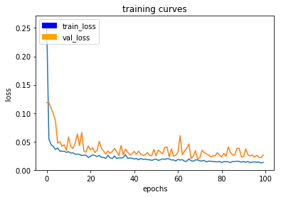
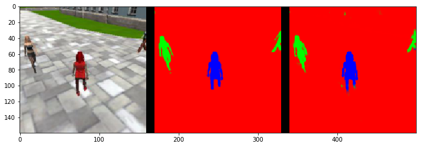
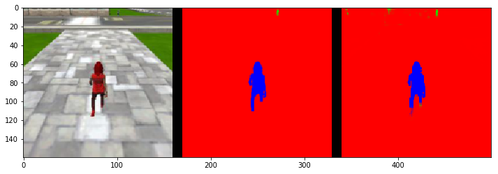
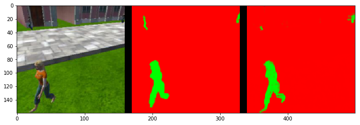
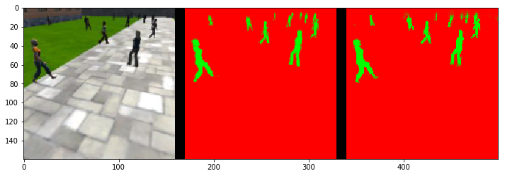
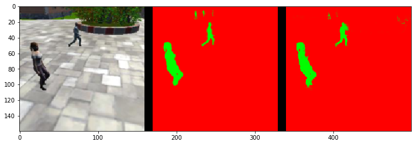

## Project: Deep Learning

### Introduction

This report provides detail of the implementation for "follow me" project which trains a deep neural network to identify and track a target in simulation. 

#### Network architecture

So far, the fully connected layers, which is good at tasks of image classification, can only tell what/who is inside the frame. This project applies fully convolutional network to tell the location of the object  in the frame. There are 2 stages of the network: (1) encoder, and (2) decoder. Those 2 stages are connected by 1x1 convolutional layer.

##### Encoders

The encoder section helps the network to learn details of image for object classification and down-samples the input image. One caveat is encoder may cause the loose of some overall information. The countermeasuer is to apply skip layer. It concatenates some layers in the encoder section to the corresponding layers in the decoder section to maintain the flow of overall-scaled information.

##### Decoders

The output of the 1 x 1 convolution is pumped into the bilinear upsample layers one after another. Finally, the output is upsampled to the same size as the input layer. The trained kernels for classification from the encoder are mapped to the full size as the input images.

##### 1x1 Convolution

The encoder section and the decoder section are connected with a 1 x 1 convolutional layer. The output of a convolutional layer is a 4D tensor. The 1x1 convolution helps in reducing the dimensionality of the filter space[3]. Meanwhile , the 1x1 convolution also helps to retain spatial information. Also, 1x1 convolution is equivalent to cross-channel parametric pooling layer, allowing complex and learnable interactions of cross channel information.

#### Training process and Experimenting

At first, I setup to run the workspace on local Linux PC without the graphics card acting as accelerator. The run always was hung up intermittently. After lots of effort googling the possible fixes, I realize the need of using GPU to run training phase. Hopefully, the online GPU workspace offered by Udacity for 72-hour is quite enough to complete the project.

Here are the final hyper-parameters. It gives the final IOU about 0.44 with the run-time on GPU about 1 hour.

learning_rate = 0.005
- defines the ratio that how much the weights are updated in each propagation. A higher learning rate may fasten the training process; however, it may also make the results less accurate.

batch_size = 32
- number of training samples/images being propagated through the network in a single pass.

num_epochs = 100
- number of times the entire training dataset gets propagated through the network.

steps_per_epoch = 100
- number of batches of training images that go through the network in 1 epoch. One recommended value to try would be based on the total number of images in training dataset divided by the batch_size.

validation_steps = 50
- number of batches of validation images that go through the network in 1 epoch. This is similar to steps_per_epoch, except validation_steps is for the validation dataset.

workers = 4
- maximum number of processes to spin up. This can affect your training speed and is dependent on your hardware.

The picture below is the final loss after 100 epochs.

#### Results and Conclusion

The performance of this network structure is good enough. I did not have a chance to capture extra data. Testing with the sample data produce the expected ~0.4 IOU. The trained network successfully accomplishes the tasks of image segmentation and image identification. 

Below are some results from the run.

- Images while following the target 

- Images while at patrol without target

During the time of project, I found out some interesting topic talking of increasing the quality of the training process as by tweaking the training data. One appoach is to increase the size of input images. Larger size feeds more detailed information to the FCN network; hence, it increases the accuracy for the model to 'learn'. Another approach is to create new 'sample images' by flipping the images in the original train dataset. This may not only increase the size of the training set, but also may reduce the spatial dependency as well. One more approach is to collect more images and joining them to the training set may also increase the performance quite largely. I did not have time to apply those in this project; maybe, it will be my todo once re-visitting this project in the future.

Finally, I think that this model can be reused to detect other classes such as cats, dogs or people in white T-shirt and so one. The things need to be modified is the mask images used by the training process.